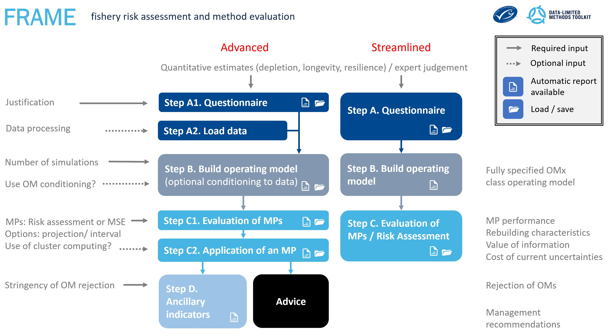

 

# Version notes

Changes for 2.6

* Advice is calculated automatically when data are loaded
* Users can specify the sets of MPs to calculate advice: three custom MPs, the MP from the Application MSE, the MPs from the Evaluation MSE or all of the feasible MPs

Changes for version 2.5

* App redesigned with 'Streamlined' and 'Advanced' modes
* Risk assessment vs MSE is now about what MPs are selected and happens in Evaluation model
* MSE convergence diagnostics in Evaluation mode
* Management advice can now be calculated in-app
* The bug Ricky detected in Application mode is now fixed (need to run FMSYref in addition to chosen MP to calculate relative yield)
* Various bugs have been sorted relating to hosting of the app

Changes for version 2.0

* Overhauled to a linear step A-D design
* Modals (warning pop ups) to prevent errors
* Parallel will work with next release of DLMtool (5.2.3)
* Life history parameter inputation (just need M question to inform maturity and growth) based on meta-analysis of FishBase data 
* Any DLMtool / MSEtool operating model can be uploaded (based on a rip from SS3 for example)
* Multivariate exceptional circumstances included (e.g. Carruthers and Hordyk 2018)
* OM conditioning by stochastic SRA (e.g. Walters 2008) 
* Data report (html floating headings will work with next DLMtool version (5.2.3))
* Inclusion of data-rich MPs designed in TMB such as Statistical catch at age (SCA), state-space delay-different and state-space surplus production models (of MSEtook Huyhn et al. 2018)
* Guides to all MPs

Coming soon:

* Smart feasibility (use data to limit MP running or alternatively add labels to tables)
* Advice automated reporting
* Power analysis for ancillary indicators
* Bioeconomic component
* Robustness questions (e.g. regime shifts, trends in natural mortality rate)

# Introduction

FRAME is software for conducting rigorous fishery risk assessment. It links a streamlined user interface to the advanced OMx operating model of DLMtool and MSEtool, using management strategy evaluation to identify sustainable fishery management procedures (MPs).

The online App includes interactive help and links to external documentation. This document is intended to provide additional information and guidance for FRAME users beyond the help provided by the online App

There are two modes to FRAME. 

* Streamlined mode is less complex and uses the quantitative questionnaire to parameterize a operating model for risk assessment of multiple MPs. 

* Advanced mode includes tools for conditioning operating models on data, doing detailed MSE analysis of a single selected MP, detecting 'exceptional circumstances' (when to reject an operating model) and calculation of real management advice

As they work through the various steps the user can save their questionnaire, operating models, evaluation or application MSE runs. This allows the user to enter the process at any step without necessarily completing earlier steps. 

At each step the user has the option of documenting their progress using automatic reports. These are .html reports that record specific aspects such as the questions answered and the justification for those answers. 

 
 

Figure 1. The features of the FRAME app in the 'Streamlined' and 'Advanced' modes. 

 
 

# Step A. Quantitative Questionnaire. 

A very large number of exploratory fishery simulations were used to identify the most important aspects of fishery dynamics that determine the performance ranking of various management procedures (MPs, e.g. size limits, catch control by DCAC, an area closure). 

This analysis was used to design a quantitative questionnaire comprising of 21 questions: 

* Fishery: 14 questions that focus on the nature of the stock and fishery dynamics 
* Management: 3 questions that relate to the management system  
* Data: 4 questions that describe the types of data that are available and their quality

FRAME allows for a high degree of uncertainty over any of these attributes. By default the questions come with the maximum level of uncertainty prescribed and assume bad quality of data. As the user narrows the ranges of answers they are expected to provide a justification for this additional certainty. 

At any time the user can move on to step B and build an operating model.  

  

## The Fishery Tab

The Fishery panel is a set of questions about the characteristics of the fish population and its fishery.

### Fishery description

Describe the fishery you are modelling and identify yourself and the relevant management agency.

### Longevity

How long lived is the fish species? This is a critical input determining stock productivity. The parameter M is the instantaneous natural mortality rate. For a review of data-limited methods of estimating M see [Kenchington (2014)](http://onlinelibrary.wiley.com/doi/10.1111/faf.12027/abstract). 

### Stock depletion

Depletion D, refers to current spawning stock biomass relative to unfished.

Since depletion is a data-rich quantity it may not be readily quantified and it may be necessary to specify a wide range of uncertainty for this input to identify MPs that are suitably robust.

In a data-limited situation, coarse information regarding depletion may be obtained from examining length compositions, historical versus current catch rates, or by use of so-called Robin-Hood approaches.

For further information see [Carruthers et al. (2014)](http://www.sciencedirect.com/science/article/pii/S0165783613003081) and [Punt et al (2011)](https://academic.oup.com/icesjms/article/68/5/972/653125/Among-stock-comparisons-for-improving-stock) 

### Resilience

How resilient to exploitation is the stock? This question controls recruitment compensation - the extent to which recruitment is reduced from unfished levels (R0) as the spawning stock becomes increasingly depleted below unfishe levels (SSB0). Here resilence is expressed in terms of steepness (h): the fraction of unfished recruitment at 1/5 unfished spawning biomass.

For a useful review of compensatory density dependence in fish populations see [Rose et al. (2001)](http://hqczhzkgch48vzcc4czubj6v.wpengine.netdna-cdn.com/files/2012/07/Rose_etal_FishFisheries.pdf). 

### Trend of historical exploitation

What temporal pattern best describes the trend in historical exploitation rates (aka fishing mortality rates or F)? If more than one answer is given, historical fishing will be simulated subject to all trends in equal frequency. If it can be assumed that fishing effort is proportional to exploitation rate this can be summarized as historical patterns in fishing effort (e.g. boat-days per year, number of trips per year). This set of answers specified the possible range of mean trends, you will have an opportunity to adjust the extent of interannual variability in the following question.
Here is a basic introduction to fishing effort and the assumption of proportionality courtesy of the [UN FAO](http://www.fao.org/docrep/x5685e/x5685e04.htm). 

### Variability in historical exploitation

The extent of interannual variability in historical exploitation rates around the mean trend(s) specified in Fishery question #5.
Again, here is the introduction to effort and exploitation rate by the [UN FAO](http://www.fao.org/docrep/x5685e/x5685e04.htm).

### Selectivity relative to length at maturity

Fishing gear selectivity relative to size at maturity (S). For example, if 50% of 40cm fish are caught by the gear and length at 50% maturity is 50cm, S = 4/5.

The UN FAO explain something of fishing gear selectivity and how it may be quantified in an [introductory document](http://www.fao.org/docrep/w5449e/w5449e08.htm). For a more involved discussion on selectivity see the [IATTC CAPAM workshop report](https://swfsc.noaa.gov/publications/CR/2013/2013Crone.pdf).

### Selectivity of large fish

Fishing gear selectivity of the largest individuals (SL). For example, if only 20% of the longest fish are caught by the gear SL = 0.2.
Again here is the [FAO introductory document](http://www.fao.org/docrep/w5449e/w5449e08.htm) and the [IATTC CAPAM workshop report](https://swfsc.noaa.gov/publications/CR/2013/2013Crone.pdf).

### Discard rate

Discard rate (DR). What fraction of fish that are caught are discarded (includes fish that are dead and alive)?

The US National Marine Fisheries Service have a [general guide to Understanding Fish Bycatch Discard and Escapee Mortality](https://www.afsc.noaa.gov/quarterly/jfm03/featurejfm03.pdf) and one of the authors of that guide, Michael Davis also has a useful article: [Key principles for understanding fish bycatch discard mortality](https://swfsc.noaa.gov/publications/CR/2013/2013Crone.pdf). 

### Post-release mortality rate
Post-release mortality rate (PRM). What fraction of discarded fish die after release?

Again here is NOAA's [general guide to Understanding Fish Bycatch Discard and Escapee Mortality](https://www.afsc.noaa.gov/quarterly/jfm03/featurejfm03.pdf) and one of the authors and the article fo Michael Davis: [Key principles for understanding fish bycatch discard mortality](https://swfsc.noaa.gov/publications/CR/2013/2013Crone.pdf).  

### Recruitment variability

Interannual variability in recruitment (the coefficient of variation in log-normal recruitment deviations, sigma R). Recruitment is expected to change among years in response to changing spawning biomass levels. On top of this is additional variability that may be driven by many factors including varying ocean conditions, amount of spawning habitat, food availability and predation. Sigma R controls the extent of this additional variability in annual recruitments. For example, a sigma R of 10% means that 95% of recruitments will fall in approximately 80-120% of the mean recruitment predicted from spawning biomass.

Edward Houde authored a [Comprehensive Review of Recruitment and Sources of Variability](https://drive.google.com/open?id=19q_ct4Xd954H2jjotX3YKy0BJ-v53bt2) and if that isn't sufficient there is [Chambers and Trippel (1997)](https://drive.google.com/open?id=1KhwP5URGPzW6ViJPiwprfY2tE2uucpDR). 

### Changing fishing efficiency

The annual % increase/decrease in fishing efficiency (q). In targetted fisheries gear efficiency may improve over time given techological improvements in the gear, bait, fish location, sharing of information etc. Conversely, non-target or bycatch species may be subject to declining fishing efficiency due to regulations or avoidance behaviors. The catchability q is the fraction of available fish caught per unit of effort. For example, a 2% per annum increase in fishing efficiency means that after 35 years twice as many fish will be caught for the same effort as today.

The introduction to fishing efficiency by the FAO provides a [basic summary](http://www.fao.org/docrep/008/y6982e/y6982e06.htm). Alternatively there is a more comprehensive review by [Arrenguin-Sanchez](https://drive.google.com/open?id=1ZrHbhotCJ5Vjw4JNloUSY94BVoM0iyfI). 

### Size of potential / existing marine reserve

The size of a potential or existing spatial closure (Marine Reserve). The size A is the % of habitat that is protected.

The FAO provides a [comprehensive review of Marine Protected Areas](http://www.fao.org/docrep/015/i2090e/i2090e.pdf). 

### Spatial mixing (movement)

The degree of stock mixing. The probability P of a fish leaving area 1 (ie. the MPA) between years

The FAO provides a [comprehensive review of Marine Protected Areas](http://www.fao.org/docrep/015/i2090e/i2090e.pdf). 

  

## The Management Tab 

The Management panel is a set of questions about what fishery management options are available and how well management advice is followed.These questions: 

* identify what management procedures are feasible given the types of management measures.
* determine the relative success of various management procedures that provide different types of advice.

### Types of fishery management that are possible

Here you indicate which MPs are feasible given the management options that are available.
Management procedures can provide management advice in terms of:

* Total Allowable Catch limits (TACs, e.g. 20,000 metric tonnes).
* Total Allowable Effort (TAE, e.g. 800 trap days per year).
* Size limits (e.g. minimum size of 45cm).
* Time-area closures (e.g. closing an area to fishing, an MPA or a Winter closure.

For more information see the UN FAO [guide to fishery management types](http://www.fao.org/docrep/005/y3427e/y3427e06.htm). 

Or alternatively, Steffanson and Rosenberg describe and discuss fishery managment types in their [2005 paper](https://drive.google.com/open?id=1V5aMNf3raitNC515qyFfITDivgbXkU4X). 

### Implementation uncertainty: consistent overages/underages

What is the possible extent to which fishing operations may exceed (overages) or fall short (underages) with respect to the specified Total Allowable Catch (TAC)and Effort (TAE)? For example, given a TAC of 1000 tonnes and a TAE of 2000 boat-days of fishing a 10% overage would on average lead to 1100 tonnes of fish taken and 2200 boat days of effort.

The FAO provides a cursory introduction to uncertainties in fisheries management including implementation error [here](http://www.fao.org/docrep/003/v8400e/V8400E03.htm). 

Fulton et al. provide a discussion of implementation error in their [2011 paper](https://drive.google.com/open?id=1gzTMnk3Cg3PzgxDdKAyV52T9IIptUK7h). 

### Implementation uncertainty: variability

In management question #2 you specified the range of possible overages/underages with respect to management recommendations. In this question you now also add the variability (V) in the implementation (TACs and TAEs) among years. For example if on average there are no overages or underages, V = 10% leads to overages/underages within 20% of the recommendation (the black line in the figure opposite) for 95% of cases. The colored lines show the minimum and maximum variability superimposed on the lowest (dashed line) and highest (solid line) levels of overages/underages specified in management question #2.

The FAO provides a cursory introduction to uncertainties in fisheries management including implementation error [here](http://www.fao.org/docrep/003/v8400e/V8400E03.htm). 

  

## The Data Tab 

The Data panel is a set of questions about what types of data are available and quality of the data that are available.
These questions: 
* identify what management procedures are feasible given the types of data available.
* determine the relative success of the various management types that rely on differing types of data.

### Types of data that are available

Management procedures require various data. Where data types are unavailable some MPs may not be feasible.

Annual catches are yearly reporting landings (e.g. 135 tonnes in 1998, 159 tonnes in 1999, etc).

Relative abundance indices may be fishery-dependent such as catch-per-unit-effort data or fishery-independent such as an annual abundance survey.

In the context of annual catches and relative abundance indices, 'historical' refers to data going back to 'unfished conditions' (pre industrial fishing) such that catches may be used to reconstruct stock trajectory and indices may infer current stock depletion. In contrast, 'recent' refers to data available for least 5 years from today.

Effort data are annual observations of fishing effort such as boat days in 2002.

Growth data refers to parameter estimates for growth parameters such as von Bertalanffy growth parameter K and mean asymptotic length, L-infinity.

Size and age composition data are samples of size and ages in the catch going back at least 2 years from today.

### Catch reporting bias

Under reporting of catches
In some data-limited fisheries, incomplete monitoring of fishing operations may lead to under-reporting (and to a lesser extent over reporting) of annual catches.

For further discussion of catch under reporting see [Agnew et al. (2009)](https://www.ncbi.nlm.nih.gov/pmc/articles/PMC2646833/). 

### Hyperstability in indices

Is the primary index of relative abundance proportional to real biomass? Indices of relative abundance derived from fishery catch-per-unit effort may decline faster than real abundance (hyperdepletion) in cases where, for example, the species is being avoided or there has been attrition of high-density sub-population structure during early commericial fishing. 

Conversely catch per unit effort data may respond slower than real biomass changes if the species is being targetted, there is range contraction of fishing toward high density areas as the stock declines or the population naturally forms aggregations. For example purse-seine fisheries are often strongly hyperstable since the fish per aggregation may remain high even at low stock sizes. 

It may be generally assumed that a well designed fishery-independent survey is proportational to abundance but there are notable exceptions.

See [Erisman et al. (1992)](https://drive.google.com/open?id=1jwhIGfTmXewKWGSTNyyjoo4TefW2JiNR) or [Maunder et al. (2006)](https://drive.google.com/open?id=1chNF72tCB_fjTjbbhZk7EyxtRU810EIc). 

### Overall data quality

What is the overall quality of data that are available?

* Perfect Information: An unrealistic and idealized observation model for testing the theoretical performance of MPs.
* Good quality: annual catches and abundance indices are observed with low error (<20% CV) and length/age composition data are numerous (~100 independent observations per year).
* Data moderate: annual catches and abundance indices are observed with greater error (<30% CV) and length/age composition data are fewer (~40 independent samples per year).
* Data poor: annual catches and abundance indices are imprecisely observed (<50% CV) and length/age composition data are sparse (~15 independent samples per year).

A description of the observation error model is included in [Carruthers et al (2013)](https://drive.google.com/open?id=1EX6mu9HOb4jwlQF-Co6DQ-FJzwTcO7JP) and a similar model was used by [Carruthers et al. (2015)](https://drive.google.com/open?id=1xvNxp_3oUOhSaLARY_mI2cAiG2qFAgqN). 

  

# Step A2: load data (Advanced model) (optional)

Users have the option of loading a formatted data object of DLMtool class Data. This can be stored in an .xlsx or .csv file.  

[Here](https://drive.google.com/open?id=1IFvKdCVGtnPzBxL-NAPIOVVo7MqC0k9p) is an example data file and a description is available [here](https://drive.google.com/open?id=1CwLXDfj6ZDxKpB4AH8BOHF-cnJCnfvAf)

  

# Step B: build an operating model

At the heart of FRAME is OMx, a rapid and flexible operating model developed for DLMtool, ( [Carruthers and Hordyk 2018](https://besjournals.onlinelibrary.wiley.com/doi/abs/10.1111/2041-210X.13081)) and the management strategy evaluation toolkit (MSEtool, Huynh et al. 2018).

An operating model is built that has a number of simulations (independent realizations of past and future fishery dynamics). A small number of simulations (e.g. 24) is needed to demonstrate the app. Evaluations of multiple MPs typically only require around 100 simulations to get stable rankings and stable absolute performance. To be sure of absolute performance for an Application of a single MP, 200 simulations or more is recommended. 

Users in the Advanced mode that have uploaded data may also use stochastic SRA of [Walters et al.](https://drive.google.com/open?id=10kpQwOsvsDCojN2MyUYgRj9-IUQMQmAB) to condition their operating models. Stochastic SRA is a Bayesian approach that obtains posterior samples of selectivity parameters (time invariant), recruitment deviations and unfished recruitment. The minimum data requirements are a complete catch history (from unfished) and a recent sample of catch composition (either length or age) data. However this version of S-SRA can also make use of patchy indices, mean length and other composition data.  

  

# Step C: Run an Evaluation (multiple MPs)

In the evaluation step, multiple MPs are tested side-by-side under identical simulated conditions. 

The user must select the future time horizon for simulation testing (the number of projected years) and the interval over which management updates will occur. For example for an interval of 4, a management recommendation would occur in years 2019, 2023, 2027.

DLMtool contains over 100 management procedures and MSEtool can combine many harvest control rules with assessments to generate numerous possible MPs. There is a dedicated webpage for each DLMtool MP that is linked in the help section at the bottom of the FRAME app and found online [here](https://dlmtool.github.io/DLMtool/reference/index.html).

The demo mode only includes a handful of fast-running MPs. Users have the option of removing reference MPs (e.g. MSY management and zero catches) including data rich MPs from MSEtool (these take longer to run). In situations where more than 48 simulations are included in the operating model, it can be much faster to select parallel processing (although this breaks the progress bar)

  

# Step C2: Run an Application (single MP) (Advanced mode)

The Application mode is very similar to the Evaluation mode but is applied to a single MP and unlocks the potential for testing exceptional circumstances in Step D. 

  

# Step D: Ancillary indicators (Advanced mode)

It is possible to detect circumstances where, once using an MP, the observations of the fishery are not consistent with those predicted by the operating model. Here we use the multivariate approach of [Carruthers and Hordyk 2018](https://drive.google.com/open?id=1V3KMFMqd0TZvbqVKwGnIZ_rZSz_Lg_2n) that was designed for this application. 

In ancillary indicators, users fill out the same data object as in step A2 but they include the most recent years of data (collected since the MP was first used). These data can then be compared statistically to those of the OM simulations under projection. If they look similar the operating model may not be rejected. Of course if they differ, the latest data may be loaded into the app in step A2 and used to condition the operating model in step B. 

Users must decide the time blocking of indicator data and the level of type I error (alpha - the probability of incorrectly rejecting the operating model).

  

# Results

## Evaluations and Applications

Users can determine the burn-in period that determines the projection years over which performance metrics 1.1.1a, 1.1.1b, 1.2.1a and 1.2.1b are calculated.

For each performance metric users can alter the threshold levels leading to recalculation of results in tables and figures. 

Management question 1 and Data question 1 also determine the feasibility of MPs. If for example TAC management is ruled out, many MPs will become color coded black in tables and figures. The 'reason not feasible' column of the results table keeps track of the reason for non-feasible MPs (M=Management, D=Data)

## Indicators

The indicator results show the location in multivariate space of the real data (an orange cross) with respect to the simulated posterior data of the MSE (blue dots). Below these plots is a summary plot that summarizes whether the observations are far from the cloud of simulated data (dissimilar and OM is rejected). 

  

# Advice

If data are loaded in step A2, it is possible to calculate management advice for:

* three user-specified custom MPs
* the MP tested in the Application
* the MPs tested in the Evaluation
* all feasible MPs

MPs differ in the type of advice they specify providing TACs (total allowable catches), TAE (total allowable effort as a fraction of todays effort), size limits and area closures. 

  

# Help

The help section is yet to be fleshed out but currently includes links to the documentation for each MP. 

  

# Report on the App or this Document

This report is subject to ongoing testing. If you find a bug or a problem please send a report to <t.carruthers@oceans.ubc.ca> so that it can be fixed or report an issue at www.github.com/DLMtool/DLMtool/issues.  

